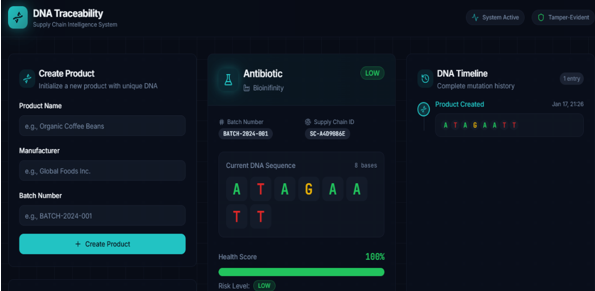
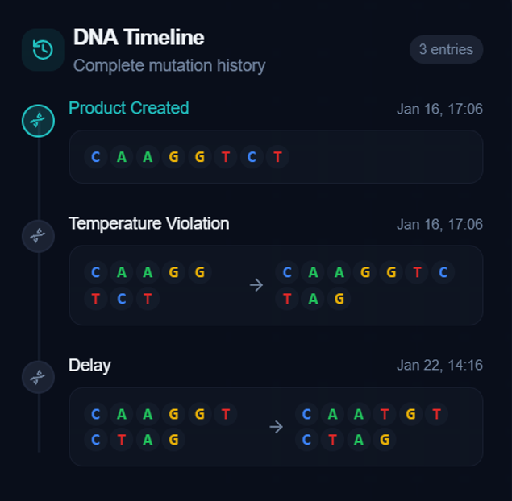

# DNA Trace — Supply Chain Tracking System

DNA Trace is a full-stack supply chain tracking system that uses DNA-inspired product identifiers to track products across different stages of the supply chain.

The system provides a web interface for product registration and tracking, with product and tracking-event data stored in a MySQL database. Cryptographic hashing is used to verify the integrity of tracking records and detect potential tampering.

## Demo
 
🔗 [Live Demo](https://project-hobby2-d930.vercel.app/)

## Key Features

- 🧬 DNA-inspired product identification
- 📦 Product registration and lifecycle tracking
- 🚚 Supply chain event history
- 🗄️ MySQL-based persistent storage
- 🔌 REST APIs for product and tracking operations
- 🔐 Cryptographic hashing for record integrity verification
- 🌐 React-based web interface

## Architecture

```
┌─────────────────────────┐
│   React + TypeScript    │
│      Web Interface      │
└────────────┬────────────┘
             │
             │ REST API
             ▼
┌─────────────────────────┐
│   Node.js + Express     │
│        Backend          │
└────────────┬────────────┘
             │
             │ SQL
             ▼
┌─────────────────────────┐
│      MySQL Database     │
│ Products + Tracking     │
│        Records          │
└────────────┬────────────┘
             │
             ▼
┌─────────────────────────┐
│  Cryptographic Hashing  │
│   Integrity Verification│
└─────────────────────────┘
```

## Tech Stack

**Frontend**
- React
- TypeScript
- Tailwind CSS
- shadcn/ui
- Vite

**Backend**
- Node.js
- Express.js

**Database**
- MySQL

**Security**
- Cryptographic hashing

## Project Structure

```
dna-based-supply-chain-traceability/
│
├── src/                    # React frontend
│   ├── components/
│   ├── pages/
│   └── ...
│
├── server/                 # Node.js + Express backend
│   ├── ...
│   └── schema.sql
│
├── images/                 # Project screenshots
│
├── .env.example
├── package.json
└── README.md
```

## Key Engineering Work

- Designed the relational database structure for products and tracking events.
- Implemented REST APIs using Node.js and Express.js.
- Built the React interface for product registration and tracking.
- Integrated MySQL for persistent supply chain data.
- Implemented cryptographic hashing to support tracking-record integrity verification.
- Connected the frontend and backend through REST APIs.

## Data Integrity

Tracking records are associated with cryptographic hash values to support integrity verification.

During verification, the hash can be recalculated from the relevant record data and compared with the stored value. A mismatch indicates that the underlying tracking information may have been modified.

> Hashing provides tamper detection and integrity verification; it does not itself prevent unauthorized database changes.

## Setup

### Prerequisites

- Node.js and npm
- MySQL
- Git

### Backend Setup

Navigate to the backend directory:

```bash
cd server
npm install
```

Create a `.env` file with your MySQL configuration:

```env
DB_HOST=localhost
DB_USER=root
DB_PASSWORD=your_password
DB_NAME=dna_trace
PORT=3001
```

Create the database:

```sql
CREATE DATABASE dna_trace;
```

Initialize the database tables:

```bash
mysql -u root -p dna_trace < schema.sql
```

Start the backend:

```bash
npm run dev
```

The backend runs on: `http://localhost:3001`

### Frontend Setup

From the project root:

```bash
npm install
npm run dev
```

If required, configure the backend API URL:

```env
VITE_API_URL=http://localhost:3001/api
```

## Screenshots


### Homepage



### Tracking Dashboard




## Future Improvements

- Role-based access for suppliers, logistics providers, and consumers
- Real-time tracking updates
- Automated integrity verification
- IoT-based tracking integration
- Supply chain analytics dashboard
- Blockchain-based verification for decentralized traceability

## License

This project is licensed under the MIT License.
